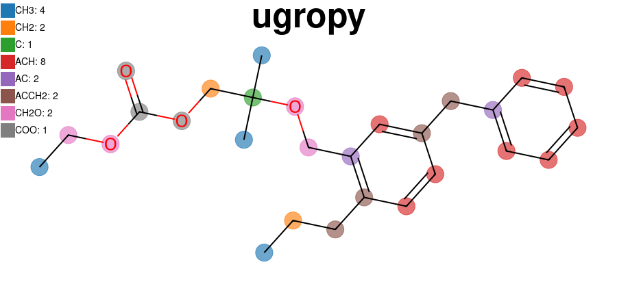

[](https://colab.research.google.com/github/ipqa-research/ugropy/blob/main/docs/source/tutorial/easy_way.ipynb)
[](https://tldrlegal.com/license/mit-license)

[](https://salvadorbrandolin.github.io/ugropy/)
[](https://badge.fury.io/py/ugropy)

`ugropy` is a `Python` library to obtain subgroups from different thermodynamic
group contribution models using both the name or the SMILES representation of a
molecule. If the name is given, the library uses the
[PubChemPy](https://github.com/mcs07/PubChemPy) library to obtain the SMILES
representation from PubChem. In both cases, `ugropy` uses the
[RDKit](https://github.com/rdkit/rdkit) library to search the functional groups
in the molecule.

`ugropy` is in an early development stage, leaving issues of examples of
molecules that `ugropy` fails solving the subgroups of a model is very helpful.

`ugropy` is tested for `Python` 3.10, 3.11 and 3.12 on Linux, Windows and Mac
OS.

# Try ugropy now
You can try `ugropy` without installing it by clicking on the Colab badge.

# Models implemented
- Classic liquid-vapor UNIFAC
- Predictive Soave-Redlich-Kwong (PSRK)
- Joback

# Writers
`ugropy` allows you to convert the obtained functional groups or estimated
properties to the input format required by the following thermodynamic
libraries:

- [Clapeyron.jl](https://github.com/ClapeyronThermo/Clapeyron.jl)
- [Thermo](https://github.com/CalebBell/thermo)


# Example of use
You can check the full tutorial
[here](https://ipqa-research.github.io/ugropy/tutorial/tutorial.html).

Get groups from the molecule's name:


```python
from ugropy import Groups


hexane = Groups("hexane")

print(hexane.unifac.subgroups)
print(hexane.psrk.subgroups)
print(hexane.joback.subgroups)
```

    {'CH3': 2, 'CH2': 4}
    {'CH3': 2, 'CH2': 4}
    {'-CH3': 2, '-CH2-': 4}

Get groups from molecule's SMILES:

```python
propanol = Groups("CCCO", "smiles")

print(propanol.unifac.subgroups)
print(propanol.psrk.subgroups)
print(propanol.joback.subgroups)
```

    {'CH3': 1, 'CH2': 2, 'OH': 1}
    {'CH3': 1, 'CH2': 2, 'OH': 1}
    {'-CH3': 1, '-CH2-': 2, '-OH (alcohol)': 1}

Estimate properties with the Joback model!

```python
limonene = Groups("limonene")

print(limonene.joback.subgroups)
print(f"{limonene.joback.critical_temperature} K")
print(f"{limonene.joback.vapor_pressure(176 + 273.15)} bar")
```

    {'-CH3': 2, '=CH2': 1, '=C<': 1, 'ring-CH2-': 3, 'ring>CH-': 1, 'ring=CH-': 1, 'ring=C<': 1}
    657.4486692170663 K
    1.0254019428522743 bar

Visualize your results! (The next code creates the `ugropy` logo)

```Python
mol = Groups("CCCC1=C(COC(C)(C)COC(=O)OCC)C=C(CC2=CC=CC=C2)C=C1", "smiles")

mol.unifac.draw(
    title="ugropy",
    width=800,
    height=450,
    title_font_size=50,
    legend_font_size=14
)
```

Write down the [Clapeyron.jl](https://github.com/ClapeyronThermo/Clapeyron.jl)
.csv input files.

```python
from ugropy import writers

names = ["limonene", "adrenaline", "Trinitrotoluene"]

grps = [Groups(n) for n in names]

# Write the csv files into a database directory
writers.to_clapeyron(
    molecules_names=names,
    unifac_groups=[g.unifac.subgroups for g in grps],
    psrk_groups=[g.psrk.subgroups for g in grps],
    joback_objects=[g.joback for g in grps],
    path="database"
)
```
Obtain the [Caleb Bell's Thermo](https://github.com/CalebBell/thermo) subgroups

```python
from ugropy import unifac

names = ["hexane", "ethanol"]

grps = [Groups(n) for n in names]

[writers.to_thermo(g.unifac.subgroups, unifac) for g in grps]
```

```
[{1: 2, 2: 4}, {1: 1, 2: 1, 14: 1}]
```

## Installation
```
pip install ugropy
```
