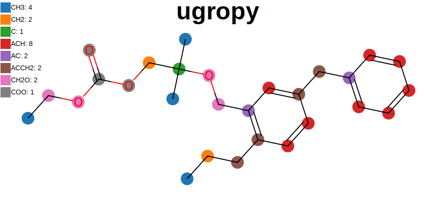

|Binder| |License| |Python 3.10+| |Docs| |PyPI version|

ugropy
======

``ugropy`` is a ``Python`` library to obtain subgroups from different
thermodynamic group contribution models using both the name or the
SMILES representation of a molecule. If the name is given, the library
uses the `PubChemPy <https://github.com/mcs07/PubChemPy>`__ library to
obtain the SMILES representation from PubChem. In both cases, ``ugropy``
uses the `RDKit <https://github.com/rdkit/rdkit>`__ library to search
the functional groups in the molecule.

``ugropy`` is in an early development stage, leaving issues of examples
of molecules that ``ugropy`` fails solving the subgroups of a model is
very helpful.

Try ugropy now
==============

You can try ugropy from its
`Binder <https://mybinder.org/v2/gh/ipqa-research/ugropy/main>`__. Open
the binder.ipynb file to explore the basic features.

Models supported v2.0.0
=======================

-  Classic liquid-vapor UNIFAC
-  Predictive Soave-Redlich-Kwong (PSRK)
-  Joback

Writers
=======

-  `Clapeyron.jl <github.com/ClapeyronThermo/Clapeyron.jl>`__
-  `Thermo <https://github.com/CalebBell/thermo>`__

Example of use
==============

You can check the full tutorial
`here <https://ipqa-research.github.io/ugropy/tutorial/tutorial.html>`__.

Get groups from the molecule’s name:

.. code:: python

   from ugropy import Groups

   hexane = Groups("hexane")

   print(hexane.unifac.subgroups)
   print(hexane.psrk.subgroups)
   print(hexane.joback.subgroups)

::

   {'CH3': 2, 'CH2': 4}
   {'CH3': 2, 'CH2': 4}
   {'-CH3': 2, '-CH2-': 4}

Get groups from molecule’s SMILES:

.. code:: python

   propanol = Groups("CCCO", "smiles")

   print(propanol.unifac.subgroups)
   print(propanol.psrk.subgroups)
   print(propanol.joback.subgroups)

::

   {'CH3': 1, 'CH2': 2, 'OH': 1}
   {'CH3': 1, 'CH2': 2, 'OH': 1}
   {'-CH3': 1, '-CH2-': 2, '-OH (alcohol)': 1}

Estimate properties with the Joback model!

.. code:: python

   limonene = Groups("limonene")

   print(limonene.joback.subgroups)
   print(f"{limonene.joback.critical_temperature} K")
   print(f"{limonene.joback.vapor_pressure(176 + 273.15)} bar")

::

   {'-CH3': 2, '=CH2': 1, '=C<': 1, 'ring-CH2-': 3, 'ring>CH-': 1, 'ring=CH-': 1, 'ring=C<': 1}
   657.4486692170663 K
   1.0254019428522743 bar

Visualize your results! (The next code creates the ``ugropy`` logo)

.. code:: python

   from IPython.display import SVG

   mol = Groups("CCCC1=C(COC(C)(C)COC(=O)OCC)C=C(CC2=CC=CC=C2)C=C1", "smiles")

   svg = mol.unifac.draw(
       title="ugropy",
       width=800,
       height=450,
       title_font_size=50,
       legend_font_size=14
   )

   SVG(svg)

Write down the
`Clapeyron.jl <https://github.com/ClapeyronThermo/Clapeyron.jl>`__ .csv
input files.

.. code:: python

   from ugropy import writers

   names = ["limonene", "adrenaline", "Trinitrotoluene"]

   grps = [Groups(n) for n in names]

   # Write the csv files into a database directory
   writers.to_clapeyron(
       molecules_names=names,
       unifac_groups=[g.unifac.subgroups for g in grps],
       psrk_groups=[g.psrk.subgroups for g in grps],
       joback_objects=[g.joback for g in grps],
       path="./database"
   )

Obtain the `Caleb Bell’s Thermo <https://github.com/CalebBell/thermo>`__
subgroups

.. code:: python

   from ugropy import unifac

   names = ["hexane", "2-butanone"]

   grps = [Groups(n) for n in names]

   [writers.to_thermo(g.unifac.subgroups, unifac) for g in grps]

::

   [{1: 2, 2: 4}, {1: 1, 2: 1, 18: 1}]

Installation
============

::

   pip install ugropy

Refereces
=========

[1] http://www.ddbst.com/published-parameters-unifac.html

[2] Joback, K. G., & Reid, R. C. (1987). ESTIMATION OF PURE-COMPONENT
PROPERTIES FROM GROUP-CONTRIBUTIONS. Chemical Engineering
Communications, 57(1–6), 233–243.
https://doi.org/10.1080/00986448708960487

[3] Joback, K. G. (1989). Designing molecules possessing desired
physical property values [Thesis (Ph. D.), Massachusetts Institute of
Technology]. https://dspace.mit.edu/handle/1721.1/14191

[4] Bondi, A. (1966). Estimation of Heat Capacity of Liquids. Industrial
& Engineering Chemistry Fundamentals, 5(4), 442–449.
https://doi.org/10.1021/i160020a001

[5] Rowlinson, J. S., & Swinton, F. (2013). Liquids and liquid mixtures:
Butterworths monographs in chemistry. Butterworth-Heinemann

.. |Binder| image:: https://mybinder.org/badge_logo.svg
   :target: https://mybinder.org/v2/gh/ipqa-research/ugropy/main
.. |License| image:: https://img.shields.io/badge/License-MIT-blue.svg
   :target: https://tldrlegal.com/license/mit-license
.. |Python 3.10+| image:: https://img.shields.io/badge/Python-3.10%2B-blue
.. |Docs| image:: https://img.shields.io/badge/docs%20-%20green?style=flat&label=Sphinx&link=https%3A%2F%2Fipqa-research.github.io%2Fugropy%2Findex.html
   :target: https://salvadorbrandolin.github.io/ugropy/
.. |PyPI version| image:: https://badge.fury.io/py/ugropy.svg
   :target: https://badge.fury.io/py/ugropy
